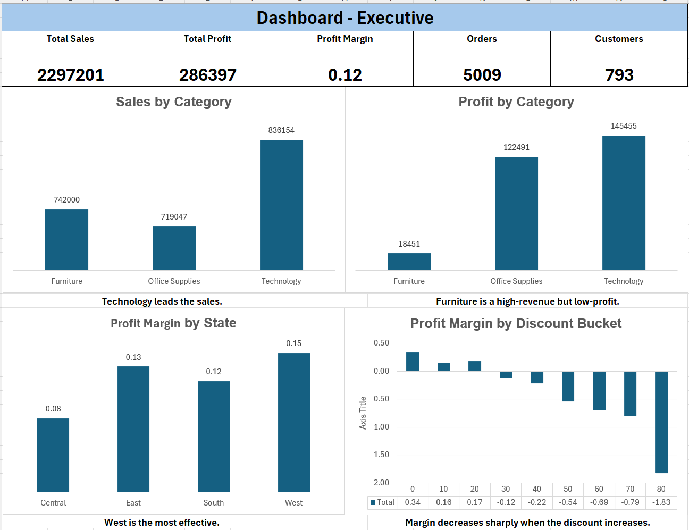
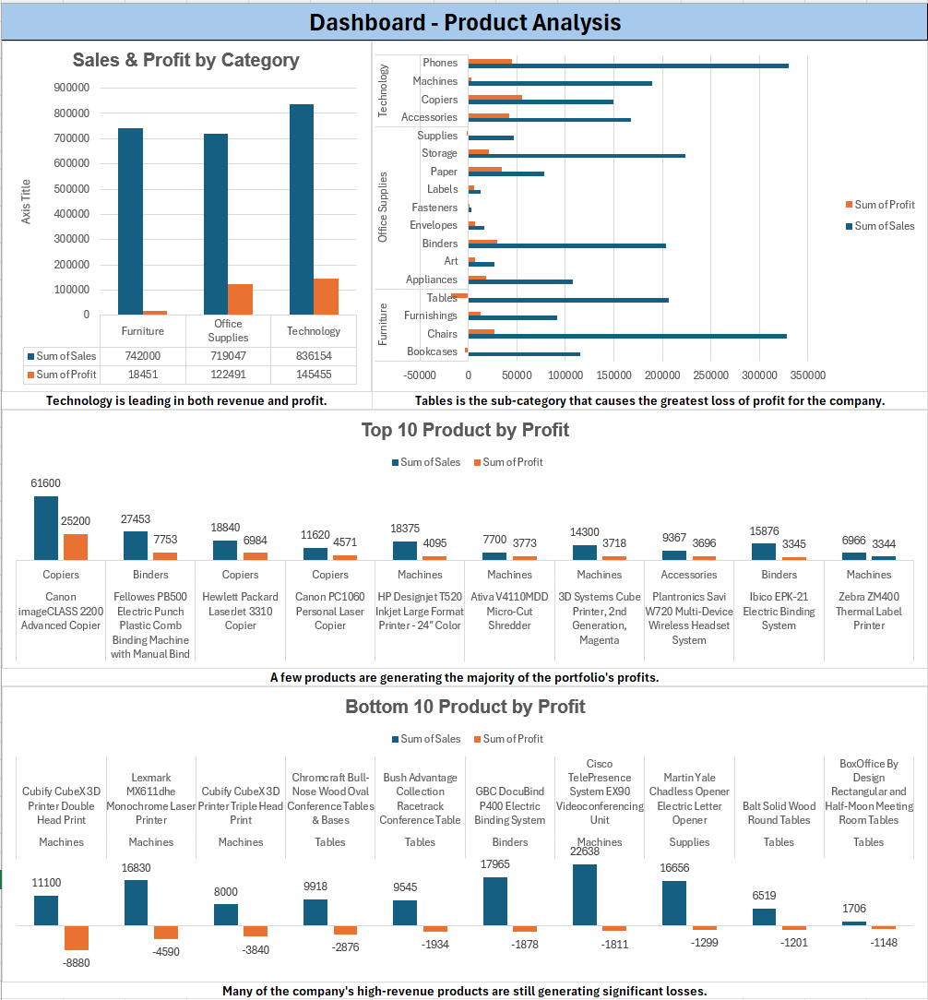
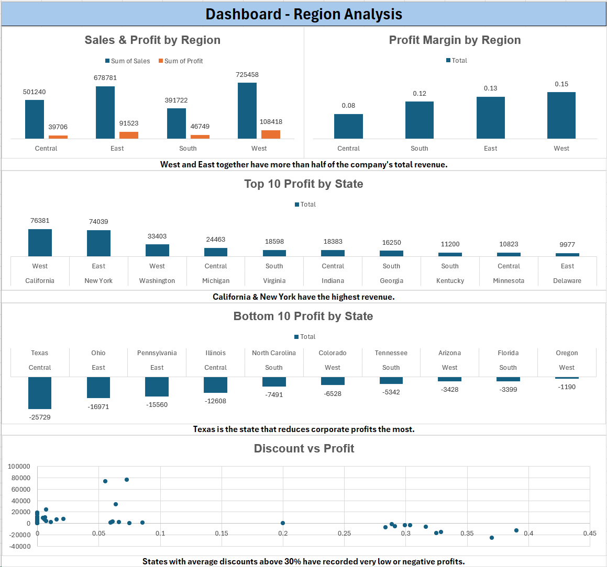
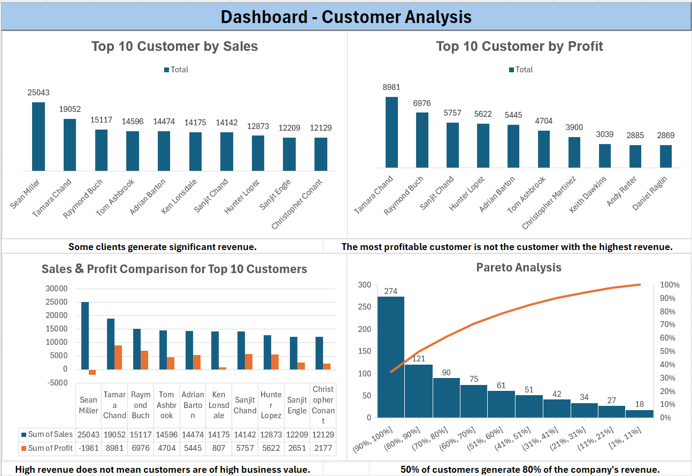
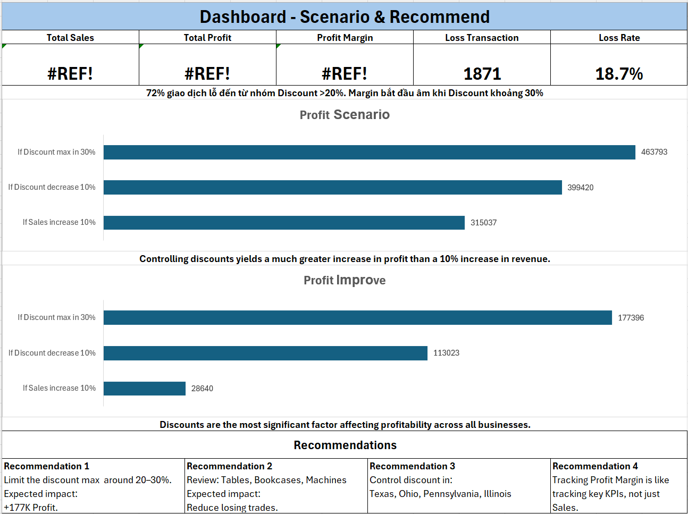

# Sales & Profitability Analysis for a Retail Company (Excel)

## Project Overview

This project analyzes sales and profitability performance of a retail company using Microsoft Excel.

Although the company achieved strong revenue growth, profit growth did not increase proportionally. The objective of this analysis is to identify the factors affecting profitability, evaluate business performance across products, regions, and customers, and provide data-driven recommendations for improving profit.

The project follows a complete Data Analytics workflow, from data auditing and transformation to business analysis, storytelling, scenario modeling, and dashboard development.

---

## Business Questions

The analysis aims to answer the following questions:

* Which regions generate the highest revenue and profit?
* Which product categories perform best?
* Which products negatively impact company profitability?
* Which customers contribute the most revenue and profit?
* How does discount affect profitability?
* What are the main drivers behind low profit margins?
* What business actions could improve profitability?

---

## Dataset

**Source:** Sample Superstore Dataset

### Dataset Summary

| Metric         | Value       |
| -------------- | ----------- |
| Rows           | 9,993       |
| Columns        | 22          |
| Period         | 2014 - 2017 |
| Regions        | 4           |
| Categories     | 3           |
| Sub-Categories | 17          |
| Customers      | 793         |
| Orders         | 5,009       |

### Main Fields

* Order Information
* Customer Information
* Product Information
* Geographic Information
* Sales Metrics
* Profit Metrics
* Discount Information

---

## Project Workflow

### Phase 1 – Data Audit

* Dataset profiling
* Missing value assessment
* Duplicate assessment
* Data structure review
* Initial business hypothesis generation

### Phase 2 – Data Cleaning

* TRIM
* CLEAN
* SUBSTITUTE
* Remove Duplicates
* Flash Fill
* Text to Columns

### Phase 3 – Data Transformation

Created additional analytical fields:

* Order Month
* Order Quarter
* Order Year
* Profit Margin
* Discount Segment
* Sales Segment

### Phase 4 – KPI Layer

Built core business KPIs:

* Total Sales
* Total Profit
* Profit Margin
* Total Orders
* Unique Customers
* Average Order Value (AOV)
* Sales per Customer
* Profit per Customer

### Phase 5 – Business Analysis

Performed:

* Product Analysis
* Regional Analysis
* Customer Analysis
* Discount Analysis

### Phase 6 – Storytelling

Identified root causes affecting profitability and connected findings across products, regions, and customers.

### Phase 7 – Scenario Analysis

Evaluated potential business outcomes under different discount and sales scenarios.

### Phase 8 – Dashboard Development

Created executive-level dashboards for decision making.

---

## Key Findings

### Product Analysis

* Technology generated the highest revenue and profit.
* Furniture generated high sales but very low profitability.
* Tables was the most unprofitable sub-category.
* Bookcases and Machines also showed weak profitability performance.

### Regional Analysis

* West was the strongest performing region.
* Texas was the largest loss-making state.
* Several low-profit states had unusually high discount levels.

### Customer Analysis

* The highest revenue customers were not always the most profitable.
* Approximately 50% of customers generated 80% of total sales.

### Discount Analysis

* Profit margin consistently decreased as discount increased.
* Profit margin became negative when discount exceeded approximately 30%.
* 72% of loss-making transactions came from discount levels above 20%.

### Root Cause

The primary driver of low profitability was excessive discounting, particularly within specific products and regions.

---

## Scenario Analysis

### Current Situation

| Metric        | Value |
| ------------- | ----- |
| Sales         | 2.30M |
| Profit        | 286K  |
| Profit Margin | 12.5% |

### Scenario Results

| Scenario            | Profit |
| ------------------- | ------ |
| Current State       | 286K   |
| Sales +10%          | 315K   |
| Discount -10%       | 399K   |
| Discount Cap at 20% | 464K   |

### Conclusion

Controlling discounts produced a significantly larger impact on profit than increasing sales volume.

---

## Business Recommendations

1. Limit discount levels to approximately 20–30%.

2. Review pricing and discount strategy for:

   * Tables
   * Bookcases
   * Machines

3. Monitor discount-heavy states:

   * Texas
   * Ohio
   * Pennsylvania
   * Illinois

4. Track Profit Margin alongside Sales as a primary business KPI.

5. Evaluate promotional campaigns based on profitability rather than revenue alone.

---

## Dashboard Preview

### Executive Dashboard

### Product Analysis

### Regional Analysis

### Customer Analysis

### Scenario & Recommendations

